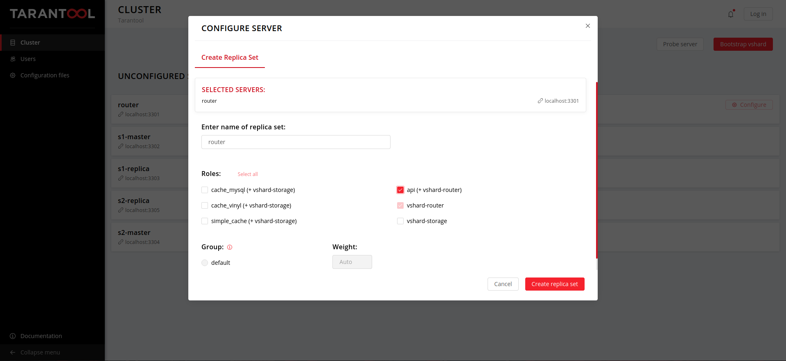
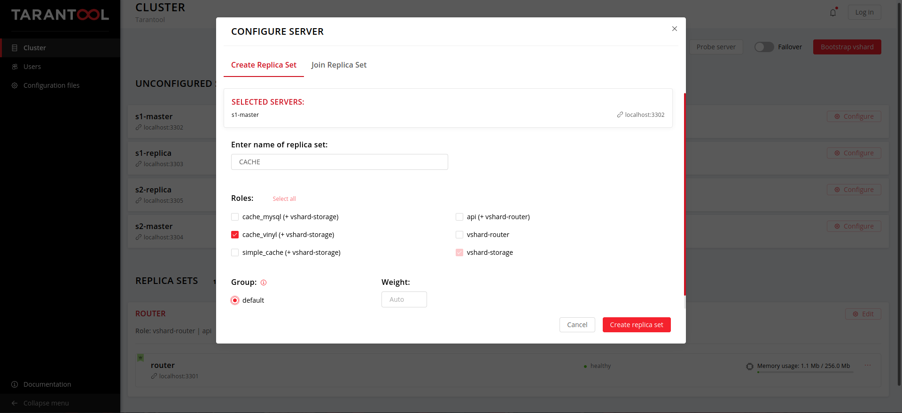

# Кэш

## Задачи

Создадим хранилище аккаунтов с поддержкой команд POST, PUT, GET, DELETE для создания, изменения, чтения и удаления аккаунта соответственно. В качестве хранилища будет использоваться следующее:

1. Обычный кэш (memcache)
2. Кэш с базой данных MySQL
3. Кэш с базой данных Vinyl

## 1. Роль Router
Будем реализовывать логику хранилища аккаунтов. Это хранилище должно быть способно обрабатывать запросы на создание и удаление аккаунтов, чтение и обновление информации. 

Начнем с создания приложения.

```
$ cartridge create --name cache 
$ cd cache
```

Первым делом необходимо создать роль Router, которая будет принимать и обрабатывать запросы, обращаясь в кэш. 

Все роли лежат в `app/roles`.

Для корректной работы подключим необходимые библиотеки.

```lua
-- api.lua
local vshard = require('vshard')
local cartridge = require('cartridge')
local errors = require('errors')

local err_vshard_router = errors.new_class("Vshard routing error")
local err_httpd = errors.new_class("httpd error")
```

Функция `verify_response` обрабатывает ошибки и формирует сообщения об ошибках, если что-то пошло не так.

```lua
-- api.lua
local function verify_response(response, error, req)
    
    -- внутренняя ошибка
    if error then
        local resp = req:render({json = {
            info = "Internal error",
            error = error
        }})
        resp.status = 500
        return resp
    end
	
    -- аккаунт не найден
    if response == nil then
        local resp = req:render({json = {
            info = "Account not found",
            error = error
        }})
        resp.status = 404
        return resp
    end

    -- некорректное поле 
    if response == -1 then
        local resp = req:render({json = {
            info = "Invalid field",
        }})
        resp.status = 400
        return resp
    end

    -- аккаунт уже существует
    if response == false then
        local resp = req:render({json = {
            info = "Account with such login exists",
        }})
        resp.status = 409
        return resp
    end
	
    -- true, если все ok
    return true
end
```


1) Функция `http_account_add` обрабатывает запрос на добавление аккаунта. 

```lua
-- api.lua
local function http_account_add(req)
    local time_stamp = os.clock()
    local account = req:json()
	local bucket_id = vshard.router.bucket_id(account.login)
    account.bucket_id = bucket_id

    local success, error = err_vshard_router:pcall(
        vshard.router.call,
        bucket_id,
        'write',
        'account_add',
        {account}
    )

    local verification_status = verify_response(success, error, req)
    if verification_status ~= true then
        return verification_status
    end

    local resp = req:render({json = { info = "Account successfully created", time = os.clock() - time_stamp}})
    resp.status = 201
    return resp
end
```

Данная функция обращается к кэшу и, если аккаунт создан, возвращает сообщение об успехе операции. 

2) `http_account_delete` удаляет аккаунт из хранилища.

```lua
-- api.lua
local function http_account_delete(req)
    local time_stamp = os.clock()
    local login = req:stash('login')
	local bucket_id = vshard.router.bucket_id(login)

    -- вызов функции удаления аккаунта из хранилища
    local success, error = err_vshard_router:pcall(
        vshard.router.call,
        bucket_id,
        'read',
        'account_delete',
        {login}
    )

    local verification_status = verify_response(success, error, req)
    if verification_status ~= true then
        return verification_status
    end

    local resp = req:render({json = {info = "Account deleted", time = os.clock() - time_stamp}})
    resp.status = 200
    return resp
end
```

3)  `http_account_get` позволяет получить значение заданного поля аккаунта.

```lua
-- api.lua
local function http_account_get(req)
    local time_stamp = os.clock()
	local login = req:stash('login')
	local field = req:stash('field')
	local bucket_id = vshard.router.bucket_id(login)

    -- запрос значения поля
    local account_data, error = err_vshard_router:pcall(
        vshard.router.call,
        bucket_id,
        'read',
        'account_get',
        {login, field}
    )

    local verification_status = verify_response(account_data, error, req)
    if verification_status ~= true then
        return verification_status
    end

    local resp = req:render({json = {info = account_data, time = os.clock() - time_stamp}})
    resp.status = 200
    return resp
end
```

4) `http_account_update` изменяет значение заданного поля аккаунта.

```lua
-- api.lua
local function http_account_update(req)
    local time_stamp = os.clock()
    local login = req:stash('login')
    local field = req:stash('field')
    local bucket_id = vshard.router.bucket_id(login)

    local value = req:json().value
	
    -- обновление поля
    local success, error = err_vshard_router:pcall(
        vshard.router.call,
        bucket_id,
        'write',
        'account_update',
        {login, field, value}
    )

    local verification_status = verify_response(success, error, req)
    if verification_status ~= true then
        return verification_status
    end

    local resp = req:render({json = {info = "Field updated", time = os.clock() - time_stamp}})
    resp.status = 200
    return resp
end
```


Назначим функции соответствующим запросам.

```lua
-- api.lua
local function init(opts)
    rawset(_G, 'vshard', vshard)

    if opts.is_master then
        box.schema.user.grant('guest',
            'read,write,execute',
            'universe',
            nil, { if_not_exists = true }
        )
    end

    local httpd = cartridge.service_get('httpd')

    if not httpd then
        return nil, err_httpd:new("not found")
    end

    -- назначение обработчиков
    httpd:route(
        { path = '/storage/:login/update/:field', method = 'PUT', public = true },
        http_account_update
    )
    httpd:route(
        { path = '/storage/create', method = 'POST', public = true },
        http_account_add
    )
    httpd:route(
        { path = '/storage/:login/:field', method = 'GET', public = true },
        http_account_get
    )
    httpd:route(
        { path = '/storage/:login', method = 'DELETE', public = true },
        http_account_delete
    )

    return true
end
```

В конце необходимо вернуть данные о роли.

```lua
-- api.lua
return {
    role_name = 'api',
    init = init,
    dependencies = {'cartridge.roles.vshard-router'},
}
```


## 2. Обычный кэш

Сперва необходимо подключить все необходимые модули.

```lua
-- simple_cache.lua
local checks = require('checks') -- для проверки аргументов функций
local lru = require('lru') -- кэш lru, реализованный с помощью двухсвязного списка
local log = require('log')
```

Функция `tuple_to_map` имеет вспомогательный характер и, как следует из названия, преобразует tuple в map.

```lua
-- simple_cache.lua
local function tuple_to_map(account)
    
    local res = 
    {
        login = account[1],
        password = account[2],
        bucket_id = account[3],
        name = account[4],
        email = account[5],
        last_action = account[6],
        data = account[7],
    }

    return res
end
```

Функция `verify_field` проверяет корректность поля, к которому обращается пользователь.

```lua
-- simple_cache.lua
local function verify_field(field)
    checks('string')
    
    if (field == 'name') or (field == 'email') or (field == 'data') 
    or (field == 'password') or (field == 'login') or (field == 'last_action') then
        return true
    end

    return false
end
```


1)  Сначала необходимо инициализировать хранилище кэша. Сделать это можно с помощью `box.schema.space.create`.

```lua
-- simple_cache.lua
local function init_spaces()
    local account = box.schema.space.create(
        'account',
        {
            format = {
                {'login', 'string'},
                {'password', 'string'},
                {'bucket_id', 'unsigned'},
                {'name', 'string'},
                {'email', 'string'},
                {'last_action', 'unsigned'},
                {'data', 'string'}
            },
            if_not_exists = true,
            engine = 'memtx',
        }
    )

    account:create_index('login', {
        parts = {'login'},
        if_not_exists = true,
    })

    account:create_index('bucket_id', {
        parts = {'bucket_id'},
        unique = false,
        if_not_exists = true,
    })

end
```

2)  `account_add` создает новый аккаунт в кэше.

```lua
-- simple_cache.lua
local function account_add(account)
    
    -- проверка существования аккаунта
    local tmp = box.space.account:get(account.login) 
    if tmp ~= nil then
        return false
    end

    box.space.account:insert({
        account.login,
        account.password,
        account.bucket_id,
        account.name,
        account.email,
        os.time(),
        account.data
    })

    return true
end
```

3)  `account_delete` удаляет аккаунт из кэша.

```lua
-- simple_cache.lua
local function account_delete(login)
    checks('string')

    local account = box.space.account:get(login)
    if account == nil then
        return nil
    end

    local account = box.space.account:delete(login)

    return true
end
```

4)  `account_get` возвращает значения определенного поля аккаунта.

```lua
-- simple_cache.lua
local function account_get(login, field)
    checks('string', 'string')
	
    -- проверка корректности поля
    if(verify_field(field) ~= true) then 
        return -1
    end

    local account = box.space.account:get(login)
    if account == nil then
        return nil
    end

    account = tuple_to_map(account)
    account["last_action"] = os.time()

    box.space.account:replace(box.space.account:frommap(account))

    return account[field]
end
```

5) Функция `account_update` позволяет изменять значения определенного поля аккаунта.

```lua
-- simple_cache.lua
local function account_update(login, field, value)

    -- проверка корректности поля
    if(verify_field(field) ~= true) then 
        return -1
    end

    local account = box.space.account:get(login)
    if account == nil then
        return nil
    end

    --обновление поля
    account = tuple_to_map(account)
    account[field] = value
    account["last_action"] = os.time()

    box.space.account:replace(box.space.account:frommap(account))

    return true
end
```


Теперь можно инициализировать хранилище и объявить функции.

```lua
-- simple_cache.lua
local function init(opts)
    if opts.is_master then

        init_spaces()

        box.schema.func.create('account_add', {if_not_exists = true})
        box.schema.func.create('account_delete', {if_not_exists = true})
        box.schema.func.create('account_update', {if_not_exists = true})
        box.schema.func.create('account_get', {if_not_exists = true})

        box.schema.role.grant('public', 'execute', 'function', 'account_add', {if_not_exists = true})
        box.schema.role.grant('public', 'execute', 'function', 'account_delete', {if_not_exists = true})
        box.schema.role.grant('public', 'execute', 'function', 'account_update', {if_not_exists = true})
        box.schema.role.grant('public', 'execute', 'function', 'account_get', {if_not_exists = true})

    end

    rawset(_G, 'account_add', account_add)
    rawset(_G, 'account_get', account_get)
    rawset(_G, 'account_delete', account_delete)
    rawset(_G, 'account_update', account_update)

    return true
end
```

В конце необходимо вернуть данные о роли.

```lua
-- simple_cache.lua
return {
    role_name = 'simple_cache',
    init = init,
    dependencies = {
        'cartridge.roles.vshard-storage',
    },
    utils = {
        account_add = account_add, 
        account_update = account_update,
        account_delete = account_delete, 
        account_get = account_get,
    }
}
```


## 3. Кэш с базой данных MySQL

Эффективным подходом при работе с базами данных является разделение данных на горячие и холодные. Горячие данные хранятся в кэше, что обеспечивает высокую скорость доступа, а холодные находятся в базе данных на жестоком диске. Реализуем подобную схему с помощью MySQL. Инструкцию по установке MySQL можно найти по [этой ссылке](https://dev.mysql.com/doc/mysql-installation-excerpt/5.7/en/). 

Сперва необходимо настроить хранилище в MySQL. Сделать это можно с помощью следующих команд:

```bash
mysql> CREATE DATABASE tarantool;
mysql> USE tarantool;
mysql> CREATE TABLE account (login VARCHAR(30), password VARCHAR(30), bucket_id INT, name VARCHAR(30), email VARCHAR(30), last_action INT, data VARCHAR(30))
```

Модифицируем кэш из предыдущего примера. Воспользуемся коннектором MySQL, который реализован в Tarantool.

```lua
-- cache_mysql.lua
local mysql = require('mysql')
```

Добавим две глобальные переменные. `lru_cache` реализует работу lru кэша. При превышении кол-ва аккаунтов в кэше некоторого значения `cache_size` из него удаляется объект, к которому дольше всего не обращались.  `conn` осуществляет взаимодействие с MySQL.

Добавим в  `init_spaces` следующие строки:

```lua
-- cache_mysql.lua
-- подключение к базе данных MySQL
conn = mysql.connect({
        host = '127.0.0.1', 
        user = 'root', 
        password = '1234', 
        db = 'tarantool'
    })

-- создание и запуск файбера для обновления данных в холодном хранилище
fiber.create(fiber_routine)

-- создание и заполнение lru кэша
lru_cache = lru.new(cache_size)
for k, account in box.space.account:pairs() do --прогрев кэша
    update_cache(account[1])
end
```


При отсутствии данных в кэше их необходимо загрузить из MySQL. 

```lua
-- cache_mysql.lua
local function fetch(login) 
    checks('string')
	-- обращение к MySQL
    local account = conn:execute(string.format("SELECT * FROM account WHERE login = \'%s\'", login))

    if (#account[1] == 0) then 
        return nil
    end

    account = account[1][1]
    local tmp = {
        account.login,
        account.password,
        account.bucket_id,
        account.name,
        account.email,
        os.time(),
        account.data
    }
	
    -- добавление аккаунта в кэш
    box.space.account:insert(tmp) 

    log.info(string.format("\'%s\' uploaded from mysql", tmp[1]))

    return tmp
end
```

Теперь в функциях `account_add`, `account_update`, `account_get` и т.д. нужно изменить формат запроса аккаунта. Если его нет в кэше, то нужно проверить холодное хранилище прежде, чем сообщать об отсутствии.

```lua
-- cache_mysql.lua
local account = box.space.account:get(login)
if account == nil then
    account = fetch(login) -- обращение к MySQL если аккаунт не найден в кэше
end

if account == nil then
    return nil
end
```

Таким образом реализуется загрузка данных из холодного хранилища. Но если к данным долго не обращаются, то их следует удалить из горячего хранилища. 

```lua
-- cache_mysql.lua
local function update_cache(login)
    checks('string')

    -- обновление положения аккаунта login в очереди кэша
    local result, err = lru_cache:touch(login)

    if err ~= nil then
        return nil, err
    end

    -- если кэш не переполнен, то ничего удалять не нужно
    if result == true then 
        return true
    end
    
    -- иначе удаление невостребованного элемента
    log.info(string.format("Removing \'%s\' from cache", result))
    box.space.account:delete(result)

    return true
end
```

`update_cache` следует вызывать при каждом взаимодействии с данными. 

При обновлении данных в кэше их можно сразу же обновлять и в холодном хранилище. Кроме того, изменения можно накапливать и обновлять хранилище батчами. Для этого создадим массив `write_queue`. При изменении аккаунта он помещается в `write_queue` с помощью функции  `set_to_update`.

```lua
-- cache_mysql.lua
local function set_to_update(login)
    checks('string')

    if write_queue[login] == nil then
        write_queue[login] = true
    end

    return true
end

```

 Накопленные изменения записываются в холодное хранилище.

```lua
-- cache_mysql.lua
local function write_behind() 

    local batch = {}
    for login, _ in pairs(write_queue) do

        local account = box.space.account:get(login)
        if (account ~= nil) then
            table.insert(batch, account)
        end
            
        if (#batch >= batch_size) then
            conn:begin()
            
            update_batch(batch)
            batch = {}
            
            conn:commit()
        end

    end

    if (#batch ~= 0) then
        conn:begin()
        
        update_batch(batch)
        batch = {}
        
        conn:commit()
    end

    write_queue = {}
    return true
end
```

Данные группируются в батчи для обновления в холодном хранилище, что реализовано в функции `update_batch`.

```lua
-- cache_mysql.lua
local function update_batch(batch)

    for _, account in ipairs(batch) do
        
        conn:execute(string.format("REPLACE INTO account value (\'%s\', \'%s\', \'%d\', \'%s\', \'%s\', \'%d\', \'%s\')", 
            account[1], 
            account[2], 
            account[3], 
            account[4], 
            account[5], 
            account[6], 
            account[7]
        ))

        log.info(string.format("\'%s\' updated in mysql", account[1]))

    end
end
```

`write_behind` необходимо запускать периодически. Для этого запущен файбер выполняющий функцию `fiber_routine`.

```lua
-- cache_mysql.lua
local function fiber_routine()
    while true do
        fiber.testcancel()
        if (os.time() - last_update) > update_period then
            write_behind()
            last_update = os.time()
        end
        
        fiber.sleep(1)
    end
end
```

В функции `account_delete` нужно также удалить аккаунт из холодного хранилища.

```     lua
-- cache_mysql.lua
conn:execute(string.format("DELETE FROM account WHERE login = \'%s\'", login ))
```


## 4. Кэш с базой данных Vinyl

Для хранения холодных данных можно использовать Vinyl, встроенный в Tarantool. Первым делом вместо подключения к MySQL в `init_spaces` настроим новое хранилище:

```lua
-- cache_vinyl.lua
local account_vinyl = box.schema.space.create( --init additional storage for cold data
    'account_vinyl',
    {
        format = {
            {'login', 'string'},
            {'password', 'string'},
            {'bucket_id', 'unsigned'},
            {'name', 'string'},
            {'email', 'string'},
            {'last_action', 'unsigned'},
            {'data', 'string'}
        },
        if_not_exists = true,
        engine = 'vinyl'
    }
)

account_vinyl:create_index('login', {
        parts = {'login'},
        if_not_exists = true,
    })

account_vinyl:create_index('bucket_id', {
        parts = {'bucket_id'},
        unique = false,
        if_not_exists = true,
    })
```

Вся логика работы с аккаунтами остается та же, необходимо лишь слегка изменить вспомогательные функции.

`fetch`:

```lua
-- cache_vinyl.lua
local function fetch(login)
    checks('string')

    local account = box.space.account_vinyl:get(login)
    if account == nil then 
        return nil
    end

    local tmp = {
        account.login,
        account.password,
        account.bucket_id,
        account.name,
        account.email,
        os.time(),
        account.data
    }
    box.space.account:insert(tmp)  

    log.info(string.format("\'%s\' uploaded from vinyl", tmp[1]))
    return tmp
end
```

`update_batch`:

```lua
-- cache_vinyl.lua
local function update_batch(batch)

    for _, account in ipairs(batch) do
        box.space.account_vinyl:upsert({
            account[1], 
            account[2], 
            account[3], 
            account[4], 
            account[5], 
            account[6], 
            account[7],
        }, {
            {'=', 1, account[1]},
            {'=', 2, account[2]},
            {'=', 3, account[3]},
            {'=', 4, account[4]},
            {'=', 5, account[5]},
            {'=', 6, account[6]},
            {'=', 7, account[7]}
        })

        log.info(string.format("\'%s\' updated in vinyl", account[1]))
    end
end
```

`write_behind`:

```lua
-- cache_vinyl.lua
local function write_behind() --update changed tuple in vinyl storage

    local batch = {}
    for login, _ in pairs(write_queue) do

        local account = box.space.account:get(login)
        if (account ~= nil) then
            table.insert(batch, account)
        end
            
        if (#batch >= batch_size) then
            box.begin()
            
            update_batch(batch)
            batch = {}
            
            box.commit()
        end

    end

    if (#batch ~= 0) then
        box.begin()
        
        update_batch(batch)
        batch = {}
        
        box.commit()
    end

    write_queue = {}
    return true
end
```


А в `account_delete` добавятся следующие строки:

```lua
-- cache_vinyl.lua
if peek_vinyl(login) then
	box.space.account_vinyl:delete(login)
end
```

где `peek_vinyl` - это функция, которая проверяет наличие аккаунта в хранилище.

```lua
-- cache_vinyl.lua
local function peek_vinyl(login) 
    checks('string')

    local account = box.space.account_vinyl:get(login)
    if account == nil then 
        return false
    end

    return true
end
```

## Добавление зависимостей 

В `init.lua` необходимо указать роли, которые будут исползоваться кластером.

```lua
-- init.lua
local cartridge = require('cartridge')
local ok, err = cartridge.cfg({
    roles = {
        'cartridge.roles.vshard-storage',
        'cartridge.roles.vshard-router',
        'app.roles.api',
    	'app.roles.simple_cache',
    	'app.roles.cache_vinyl',
    	'app.roles.cache_mysql',
    },
    cluster_cookie = 'cache-cluster-cookie',
})
```

А в файле `cache-scm-1.rockspec` нужно указать все внешние заисимости.

```lua
-- cache-scm-1.rockspec
package = 'cache'
version = 'scm-1'
source  = {
    url = '/dev/null',
}
-- Put any modules your app depends on here
dependencies = {
    'tarantool',
    'lua >= 5.1',
    'luatest == 0.3.0-1',
    'cartridge == 1.2.0-1',
}
build = {
    type = 'none';
}
```

## Тестирование 

Описанные выше роли необходимо покрыть тестами. Для этого рекомендуется использовать модуль `luatest`.

### Модульные тесты

Для проверки работы отдельных модулей кластера и ролей используются модульные тесты. Тесты для каждой роли можно найти в папке `test/unit`. В данном случае взаимодействие кэша с хранилищем MySQL имитируется с помощью заглушки `mysql_mock.lua` в папке `test`.

```lua
-- mysql_mock.lua
local connection = {
	storage = {}
}

function connection:execute(request)
	local command = string.split(request, " ")[1]

	if command == "SELECT" then
		local login = string.split(request, "\'")[2]
		local account = self.storage[login]
		return {{account}}
	end

	if command == "REPLACE" then
		local data = string.split(request, "\'")
		self.storage[data[2]] = {
			login = data[2],
			password = data[4],
			bucket_id = tonumber(data[6]),
			name = data[8],
			email = data[10],
			last_action = data[12],
			data = data[14],
		}
		return 
	end

	if command == "DELETE" then 
		local login = string.split(request, "\'")[2]
		self.storage[login] = nil
		return
	end
end

function connection:begin()
	return nil
end

function connection:commit()
	return nil
end

function connection:rollback()

	self.storage = {}
	self.storage["Mura"] = {
        login = "Mura",
        password = "1243",
        bucket_id = 2,
        name = "Tom",
        email = "tom@mail.com",
        last_action = os.time(),
        data = "another secret"
    }

end

function connect(args)

	connection.storage["Mura"] = {
        login = "Mura",
        password = "1243",
        bucket_id = 2,
        name = "Tom",
        email = "tom@mail.com",
        last_action = os.time(),
        data = "another secret"
    }

    return connection
end

return { connect = connect;}
```

Данный модуль имитирует синтаксис и логику работы с MySQL. В модульных тестах необходимо подменить модуль `mysql` данной заглушкой:

```lua
package.loaded['mysql'] = require('./test/mysql_mock')
```

Теперь команда `request('mysql')` будет возвращать модуль-заглушку.

Запустить тесты можно следующим образом:

```bash
cache $ .rocks/bin/luatest ./test/unit
```


### Интеграционные тесты

Для проверки корректного взаимодействия частей приложения друг с другом и с MySQL необходимы интеграционные тесты. Они расположены в `test/integration`. Реализуются также с помощью `luatest`.  Для выполнения данных тестов необходимо настроить хранилище MySQL и поднять тестовый кластер. Последнее делается с помощью модуля `caartridge.test-helpers` и стандартного `helper.lua` в `test`.

```lua
--helper.lua
local fio = require('fio')
local t = require('luatest')

local helper = {}

helper.root = fio.dirname(fio.abspath(package.search('init')))
helper.datadir = fio.pathjoin(helper.root, 'tmp', 'db_test')
helper.server_command = fio.pathjoin(helper.root, 'init.lua')

t.before_suite(function()
    fio.rmtree(helper.datadir)
    fio.mktree(helper.datadir)
end)

return helper
```

Для тестов необходимо два сервера. Первый будет выполнять роль роутера, а второй выступит в роли хранилища. Тогда создание тестового кластера выполняется следующим образом:

```lua
local fio = require('fio')
local t = require('luatest')
local g = t.group('simple_cache_integration')

local cartridge_helpers = require('cartridge.test-helpers')
local shared = require('test.helper')

g.before_all(function() 

	g.cluster = cartridge_helpers.Cluster:new({
	    server_command = shared.server_command,
	    datadir = shared.datadir,
	    use_vshard = true,
	    replicasets = {
	        {
	            alias = 'api',
	            uuid = cartridge_helpers.uuid('a'),
	            roles = {'api'},
	            servers = {{ instance_uuid = cartridge_helpers.uuid('a', 1),
	            			advertise_port = 13301,
	            			http_port = 8081 
	            }},
	        },
		{
	            alias = 'storage',
	            uuid = cartridge_helpers.uuid('b'),
	            roles = {'simple_cache'}, --пример для обычного кэша
	            servers = {{ instance_uuid = cartridge_helpers.uuid('b', 1),
	            			advertise_port = 13302,
	            			http_port = 8082 
	            }},
	        },
	    },
	})

	g.cluster:start()

end)
```

После завершения группы тестов необходимо данный сервер остановить и очистить его рабочую директорию.

```lua
g.after_all(function() 
	g.cluster:stop() 
	fio.rmtree(g.cluster.datadir)
end)
```

Запускаем тесты:

```
cache $ .rocks/bin/luatest ./test/integration/simple_cache_test.lua
cache $ .rocks/bin/luatest ./test/integration/cache_mysql_test.lua
cache $ .rocks/bin/luatest ./test/integration/cache_vinyl_test.lua
```


## Запуск

Соберем кластер:

```bash
cache $ tarantoolctl rocks make
```

`tarantoolctl` подтянет все указанные в `cache-scm-1.rockspec` зависимости и подготовит кластер к запуску. 

Запустим кластер:

```bash
cache $ cartridge start
```

Подключиться к веб-интерфейсу можно перейдя по адресу `http://127.0.0.1:8081/`. 

Сначала назначим роль роутеру.



Затем назначим кэш.



Запускаем **Bootstrap vshard**, и кластер готов к работе.

## Примеры

Проверим работу кластера. Создадим аккаунт:

```bash
$ curl -X POST -v -H "Content-Type: application/json" -d '{
"login": "root1", 
"name": "Aleks", 
"password": "1234", 
"email": "root@mail.com", 
"data": "secret"}' http://localhost:8081/storage/create

```

В случае успеха получим подобное сообщение:

```
*   Trying 127.0.0.1:8081...
* TCP_NODELAY set
* Connected to localhost (127.0.0.1) port 8081 (#0)
> POST /storage/create HTTP/1.1
> Host: localhost:8081
> User-Agent: curl/7.65.3
> Accept: */*
> Content-Type: application/json
> Content-Length: 99
> 
* upload completely sent off: 99 out of 99 bytes
* Mark bundle as not supporting multiuse
< HTTP/1.1 201 Created
< Content-length: 66
< Server: Tarantool http (tarantool v1.10.4-68-gf8f8adfab)
< Content-type: application/json; charset=utf-8
< Connection: keep-alive
< 
* Connection #0 to host localhost left intact
{"info":"Account successfully created","time":0.00012199999999973}
```

Попробуем изменить имя:

```bash
$ curl -X PUT -v -H "Content-Type: application/json" -d '{"value": "Bob"}' http://localhost:8081/storage/root1/update/name
```

```
*   Trying 127.0.0.1:8081...
* TCP_NODELAY set
* Connected to localhost (127.0.0.1) port 8081 (#0)
> PUT /storage/root1/update/name HTTP/1.1
> Host: localhost:8081
> User-Agent: curl/7.65.3
> Accept: */*
> Content-Type: application/json
> Content-Length: 16
> 
* upload completely sent off: 16 out of 16 bytes
* Mark bundle as not supporting multiuse
< HTTP/1.1 200 Ok
< Content-length: 51
< Server: Tarantool http (tarantool v1.10.4-68-gf8f8adfab)
< Content-type: application/json; charset=utf-8
< Connection: keep-alive
< 
* Connection #0 to host localhost left intact
{"info":"Field updated","time":0.00011600000000023}
```

Проверим, что имя изменилось:

```
$ curl -X GET -v http://localhost:8081/storage/root1/name
```

```
*   Trying 127.0.0.1:8081...
* TCP_NODELAY set
* Connected to localhost (127.0.0.1) port 8081 (#0)
> GET /storage/root1/name HTTP/1.1
> Host: localhost:8081
> User-Agent: curl/7.65.3
> Accept: */*
> 
* Mark bundle as not supporting multiuse
< HTTP/1.1 200 Ok
< Content-length: 41
< Server: Tarantool http (tarantool v1.10.4-68-gf8f8adfab)
< Content-type: application/json; charset=utf-8
< Connection: keep-alive
< 
* Connection #0 to host localhost left intact
{"info":"Bob","time":9.6000000000984e-05}
```

Удалим аккаунт:

```bash
$ curl -X DELETE -v http://localhost:8081/storage/root1
```

```bash
*   Trying 127.0.0.1:8081...
* TCP_NODELAY set
* Connected to localhost (127.0.0.1) port 8081 (#0)
> DELETE /storage/root1/ HTTP/1.1
> Host: localhost:8081
> User-Agent: curl/7.65.3
> Accept: */*
> 
* Mark bundle as not supporting multiuse
< HTTP/1.1 200 Ok
< Content-length: 53
< Server: Tarantool http (tarantool v1.10.4-68-gf8f8adfab)
< Content-type: application/json; charset=utf-8
< Connection: keep-alive
< 
* Connection #0 to host localhost left intact
{"info":"Account deleted","time":0.00010800000000089}
```

```bash
$ curl -X GET -v http://localhost:8081/storage/root1/name
```

```bash
*   Trying 127.0.0.1:8081...
* TCP_NODELAY set
* Connected to localhost (127.0.0.1) port 8081 (#0)
> GET /storage/root1/name HTTP/1.1
> Host: localhost:8081
> User-Agent: curl/7.65.3
> Accept: */*
> 
* Mark bundle as not supporting multiuse
< HTTP/1.1 404 Not found
< Content-length: 55
< Server: Tarantool http (tarantool v1.10.4-68-gf8f8adfab)
< Content-type: application/json; charset=utf-8
< Connection: keep-alive
< 
* Connection #0 to host localhost left intact
{"time":0.00021399999999971,"info":"Account not found"}
```

